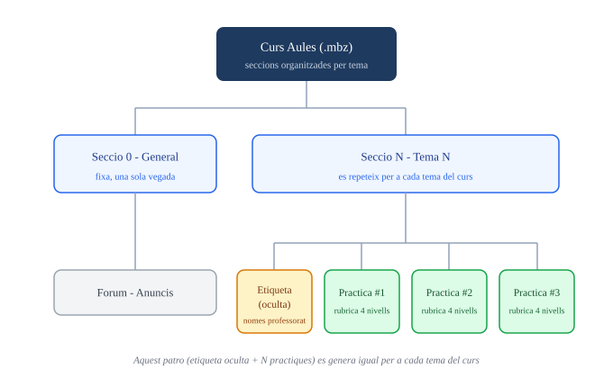
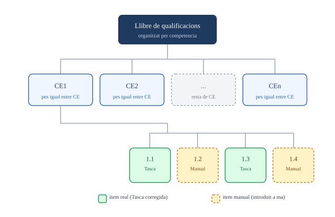

# 🎓 cursoaules — genera un curso completo de Aules desde un currículum PDF


Genera un curso completo de Aules (Moodle de la GVA) en segundos, a partir del PDF de un currículum oficial. El resultado es un archivo `.mbz` que se restaura como cualquier backup de Moodle, con el curso ya organizado por temas y con el libro de calificaciones vinculado a las competencias y criterios de evaluación del currículum.

## Por qué existe

Montar esto a mano en Aules es lento y hay que rehacerlo cada curso escolar y para cada asignatura: crear cada sección, cada categoría de calificación, cada actividad, cada rúbrica, cada peso. Esta skill hace ese trabajo una vez, a partir de la información que ya está en el propio PDF del currículum, y entrega un `.mbz` que se restaura en el asistente de Aules en un par de minutos.

## Qué genera exactamente

### Estructura de contenidos (secciones del curso)

El curso tiene una sección "General" fija (con un foro de anuncios) y una sección por cada tema del currículum. Cada sección de tema lleva dos cosas: una etiqueta oculta con las notas pedagógicas del tema (solo la ve el profesorado) y un número de actividades "Practica" evaluables y públicas.



La etiqueta oculta reúne, para el profesorado, la competencia principal del tema con su texto literal, el desglose completo de todos sus criterios de evaluación (no solo el rango "1.1-1.6"), lo mismo para cualquier competencia secundaria/transversal, y el mapeo explícito de qué práctica evalúa qué criterios. El alumnado no la ve en ningún momento — Moodle la trata como una actividad oculta normal.

Por defecto se generan 3 Practicas por tema (`Practica Tema#N #1`, `#2`, `#3`), cada una del tipo Tasca (`mod_assign`), pensada para que el profesorado añada el enunciado concreto cuando lo necesite. Los "Recursos" (actividades H5P o paquetes SCORM) no se generan aquí, porque Moodle exige subir ya un contenido real al crearlos — se añaden después a mano, por ejemplo con las skills `h5p` o `pasapalabra`.

### Libro de calificaciones (por competencia, no por tema)

Esta es la diferencia principal frente a una plantilla genérica de Moodle: el libro de calificaciones no sigue la estructura de temas o evaluaciones del curso, sino la de las competencias específicas del currículum, con la misma jerarquía en todas las asignaturas.



Cada competencia específica (CE1, CE2...) es una categoría con el mismo peso que las demás, y dentro de cada una, cada criterio de evaluación (1.1, 1.2...) es una subcategoría con el mismo peso que sus hermanos. Cada Practica evalúa, por defecto, dos criterios consecutivos de la competencia de su tema (la #1 evalúa los dos primeros, la #2 los dos siguientes, y así sucesivamente). Como una actividad de Moodle solo puede tener un elemento de calificación propio, el primer criterio de cada pareja recibe la nota directamente de la Tasca corregida, y el segundo se resuelve con un elemento de calificación manual (sin actividad asociada) en su propia categoría, donde el profesorado introduce a mano la nota de ese segundo criterio tras corregir el mismo trabajo — es el mecanismo estándar de Moodle para que una sola actividad cuente en más de un criterio.

### Rúbrica de corrección en cada Practica

Cada Practica lleva ya configurada una rúbrica (método de calificación avanzada de Moodle), con una fila por cada criterio que evalúa (1 o 2) y 5 niveles de logro fijos por fila:

| Nivel | Puntos | Significado |
|---|---|---|
| Insuficient | 0/4 | No aplica, o aplica de forma muy incompleta o incorrecta, el criterio. |
| Suficient | 1/4 | Aplica el criterio de forma básica, con errores relevantes o necesitando ayuda constante. |
| Be | 2/4 | Aplica el criterio de forma mayoritariamente correcta, con alguna ayuda puntual o errores menores. |
| Notable | 3/4 | Aplica el criterio correctamente y de forma autónoma, con alguna carencia muy menor. |
| Excel·lent | 4/4 | Aplica el criterio de forma autónoma, correcta y completa, aportando justificación o reflexión propia. |

El texto de cada nivel incrusta el texto literal del criterio correspondiente, así que la rúbrica sale ya redactada sin que el profesorado tenga que escribir nada. Moodle convierte la puntuación obtenida a la nota sobre 10 de la Tasca de forma proporcional. Este esquema de 5 niveles se confirmó contra una copia de seguridad real de una sola actividad que se probó en Aules.

## Cómo se usa

Se le indica a Claude el PDF del currículum oficial de la asignatura (y el curso, si el currículum cubre varios cursos) y qué se quiere generar — por ejemplo: "genera el curso de Aules para Digitalización 4º ESO a partir de este currículum". Claude extrae del PDF las competencias, sus criterios de evaluación y los bloques de contenidos, organiza los temas, construye el `.mbz` y lo entrega listo para restaurar: en Aules, dentro de un curso vacío nuevo, Ajustes > Restaurar, subir el archivo y seguir el asistente.

## Modo alternativo: pesos por evaluación (Activitats/Recursos/Examen)

Si se pide explícitamente, el libro de calificaciones puede organizarse en cambio como **Curso → Avaluació → Activitats (CE→Criterio) / Recursos / Examen**, con pesos configurables (p. ej. 50%/30%/20%) entre esas tres partes de cada evaluación. En este modo cada tema genera un número FIJO de Practicas (por defecto 4, configurable), cada una evaluando un criterio concreto por rotación (no un número variable igual al de criterios de su competencia, y no por parejas); un tema puede además añadir Recursos extra propios via `recursos_extra` (p. ej. `["binarygame"]` para el Cisco Binary Game en el tema de sistemas numéricos), y al final de cada evaluación se añade una sección "Examen" con una Tasca que califica todas las competencias trabajadas en esa evaluación (incluidas las transversales). Recursos también califica esas mismas competencias, con un elemento de calificación manual por cada una que el profesorado rellena al añadir contenido real; hasta entonces ese peso no se aplica. El Examen lleva marcada la nota mínima de 5 para aprobar, aunque hay que revisar manualmente la avaluación si no se llega — la media ponderada de Moodle no aplica ese mínimo de forma automática.

## Avisos importantes

Las Tasques, sus rúbricas y el libro de calificaciones por competencia/criterio ya están verificados contra restauraciones reales en Aules. El modo alternativo por evaluación (categorías anidadas con pesos y el examen multi-competencia) es nuevo y todavía no se ha probado contra una restauración real — pruébalo en un curso de pr

## Requisitos

- Python 3.
- El PDF del currículum oficial de la asignatura.

## Cómo se usa (resumen rápido)

**Con Claude / un asistente IA:** dale el PDF del currículum y pídele "genera el curso de Aules para [asignatura] [curso] a partir de este currículum". Extrae competencias, criterios y contenidos, y genera un `.mbz` listo para restaurar (Aules → curso vacío → Ajustes → Restaurar → subir el archivo).

## Estructura del repositorio

```
cursoaules/
├── scripts/
│   ├── build_mbz.py              # generador principal del .mbz
│   ├── schema_example.json        # ejemplo de esquema de entrada
│   └── assets_recursos/           # recursos SCORM/H5P de ejemplo listos para incluir
├── evals/                          # casos de prueba
├── estructura_continguts.svg
├── estructura_qualificacions.svg
└── SKILL.md                        # instrucciones detalladas (uso con Claude)
```

## Licencia

CC BY-SA 4.0 — ver [LICENSE.md](LICENSE.md). Libre de usar y adaptar citando la autoría.
